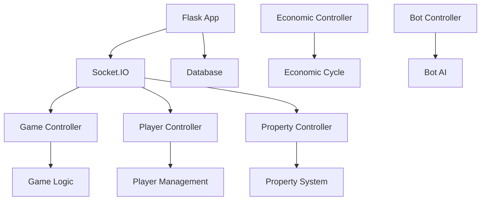
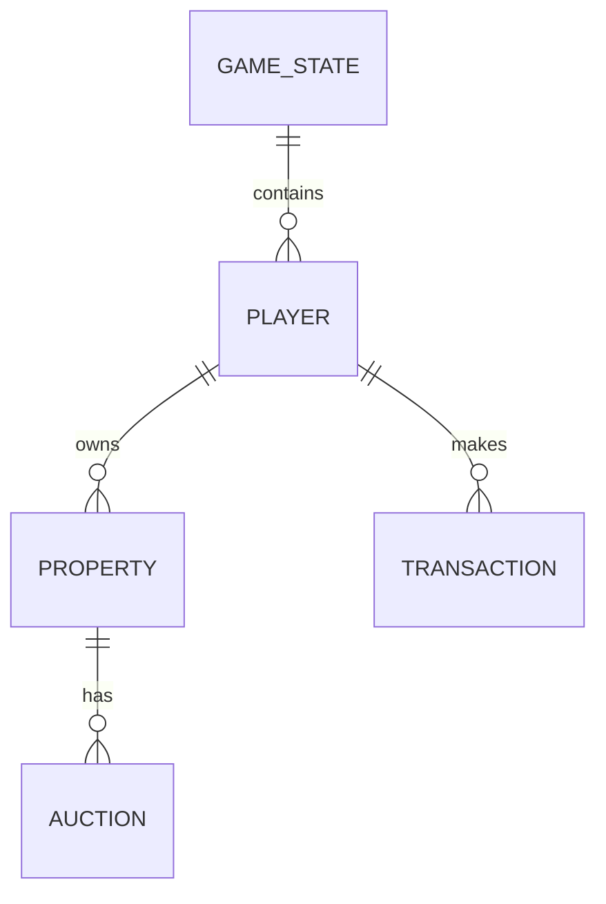

# Monopoly Game Architecture Documentation

## Table of Contents
1. [System Architecture](#system-architecture)
2. [Core Components](#core-components)
3. [Key Processes](#key-processes)
4. [Database Schema](#database-schema)
5. [Technical Details](#technical-details)
6. [Known Issues and Improvements](#known-issues-and-improvements)

## System Architecture

### Overview
The Monopoly game is implemented as a Flask-based web application with real-time communication using Socket.IO. The system follows a modular architecture with clear separation of concerns between different components.

### Directory Structure
```
src/
├── controllers/         # Business logic controllers
├── models/             # Database models
├── routes/             # API route handlers
├── migrations/         # Database migrations
├── utils/             # Utility functions
└── game_logic/        # Core game mechanics
```

### Component Interaction


## Core Components

### Game State Management
The game state is managed through the `GameState` model, which tracks:
- Active games
- Current player turns
- Game phase
- Economic state
- Game configuration

Key methods:
```python
class GameState:
    def process_economic_cycle(self):
        # Handles economic state transitions
        pass

    def update_game_phase(self):
        # Updates current game phase
        pass
```

### Player Management
Players are managed through the `Player` model, supporting both human and bot players:

```python
class Player:
    def __init__(self):
        self.money = 1500
        self.position = 0
        self.properties = []
        self.is_bot = False
```

Bot players use different strategies:
- Conservative: Focuses on safe investments
- Aggressive: Takes high-risk investments
- Strategic: Balances property monopolies

### Property System
Properties are managed through the `Property` model:

```python
class Property:
    def calculate_rent(self):
        # Calculates current rent based on:
        # - Base rent
        # - Number of houses/hotels
        # - Economic state
        pass

    def update_value(self):
        # Updates property value based on economic cycle
        pass
```

### Financial System
The financial system is handled by the `Banker` class:

```python
class Banker:
    def process_transaction(self, from_player, to_player, amount):
        # Handles money transfers between players
        pass

    def process_loan(self, player, amount):
        # Handles loan creation and payments
        pass
```

### Board/Space Management
Special spaces are managed through the `SpecialSpaceController`:

```python
class SpecialSpaceController:
    def handle_landing(self, player, space_type):
        # Processes player landing on special spaces
        pass
```

## Key Processes

### Game Initialization
1. Create new game state
2. Initialize players
3. Set up initial money and properties
4. Configure economic cycle
5. Start first player's turn

### Turn Sequence
1. Roll dice
2. Move player
3. Process space effects
4. Handle property interactions
5. End turn

### Property Purchase Flow
1. Player lands on property
2. Check if available
3. Offer purchase
4. Process payment
5. Update ownership

### Economic Cycle
The economic cycle affects:
- Property values
- Rent amounts
- Interest rates
- Random events

## Database Schema

### Key Tables
- `players`: Player information
- `properties`: Property details
- `game_state`: Current game state
- `transactions`: Financial transactions
- `auctions`: Property auctions

### Entity Relationships


## Technical Details

### API Endpoints
Key endpoints:
- `/api/health`: System health check
- `/api/admin/*`: Admin operations
- `/api/game/*`: Game operations
- `/api/player/*`: Player operations

### Socket Events
```python
@socketio.on('get_all_players')
def handle_get_all_players(data):
    # Handles player list requests
    pass

@socketio.on('finance_update')
def handle_finance_update(data):
    # Handles financial updates
    pass
```

### Error Handling
The system uses a centralized error handling approach:
1. Log errors with context
2. Return appropriate HTTP status codes
3. Provide user-friendly error messages
4. Maintain audit trail of errors

## Known Issues and Improvements

### Current Issues
1. Economic cycle synchronization
2. Bot decision-making optimization
3. Property value calculation accuracy

### Planned Improvements
1. Enhanced bot AI
2. Improved economic simulation
3. Better error recovery
4. Performance optimization

### Security Considerations
1. Admin authentication
2. Transaction validation
3. Input sanitization
4. Rate limiting

## Development Guidelines

### Adding New Features
1. Create appropriate models
2. Implement controllers
3. Add routes
4. Update documentation
5. Add tests

### Testing
1. Unit tests for core logic
2. Integration tests for flows
3. Performance testing
4. Security testing

### Deployment
1. Environment configuration
2. Database migration
3. Service startup
4. Health monitoring 