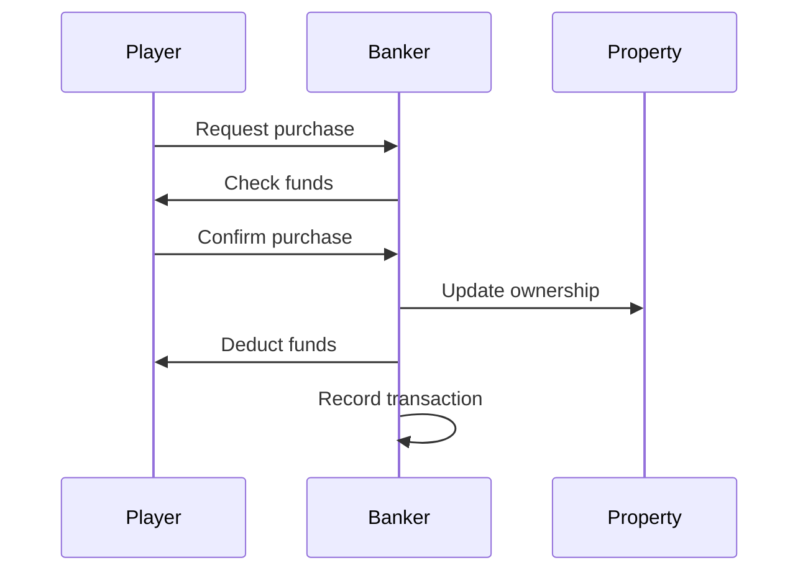
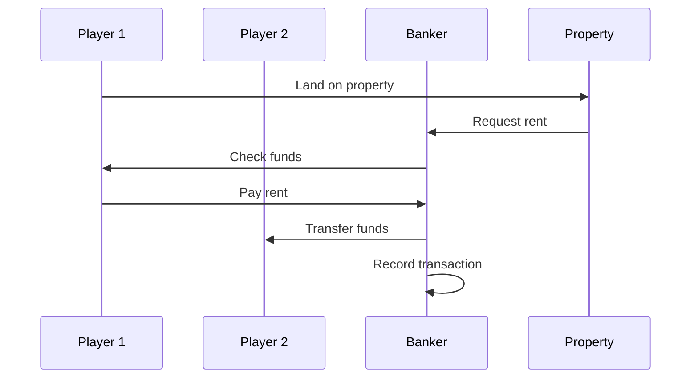

# Financial System Documentation

## Overview
The financial system in the Monopoly game handles all monetary transactions, including property purchases, rent collection, loans, and economic effects. It's designed to be robust and handle complex financial scenarios while maintaining game balance.

## Components

### Banker
The `Banker` class is the central component managing all financial transactions:

```python
class Banker:
    def __init__(self, socketio):
        self.socketio = socketio
        self.transaction_history = []
```

### Key Financial Operations

#### 1. Property Transactions
```python
def process_property_purchase(self, player, property, amount):
    """
    Handles property purchase transactions
    - Validates player's funds
    - Processes payment
    - Updates ownership
    - Records transaction
    """
    pass

def process_rent_payment(self, from_player, to_player, property, amount):
    """
    Handles rent payments between players
    - Calculates rent amount
    - Processes payment
    - Handles insufficient funds
    - Records transaction
    """
    pass
```

#### 2. Loan Management
```python
def create_loan(self, player, amount, interest_rate):
    """
    Creates a new loan for a player
    - Validates loan amount
    - Sets interest rate
    - Records loan details
    - Updates player's balance
    """
    pass

def process_loan_payment(self, player, loan, amount):
    """
    Processes loan payments
    - Applies payment to principal/interest
    - Updates loan balance
    - Handles early repayment
    - Records transaction
    """
    pass
```

#### 3. Economic Effects
```python
def apply_economic_effects(self, player, economic_state):
    """
    Applies economic cycle effects to player's finances
    - Adjusts property values
    - Updates rent amounts
    - Modifies interest rates
    - Records changes
    """
    pass
```

## Transaction Flow

### 1. Property Purchase


### 2. Rent Collection


## Error Handling

### Insufficient Funds
```python
def handle_insufficient_funds(self, player, required_amount):
    """
    Handles cases where player doesn't have enough money
    - Offers loan options
    - Suggests property sales
    - Handles bankruptcy
    """
    pass
```

### Transaction Validation
```python
def validate_transaction(self, from_player, to_player, amount):
    """
    Validates transaction before processing
    - Checks player existence
    - Verifies sufficient funds
    - Validates amount
    - Ensures game state allows transaction
    """
    pass
```

## Economic Integration

### Property Value Fluctuation
```python
def update_property_values(self, economic_state):
    """
    Updates property values based on economic state
    - Boom: Values increase
    - Recession: Values decrease
    - Stable: Minimal changes
    """
    pass
```

### Rent Adjustment
```python
def adjust_rent_rates(self, economic_state):
    """
    Adjusts rent rates based on economic state
    - Boom: Higher rents
    - Recession: Lower rents
    - Stable: Base rents
    """
    pass
```

## Security Measures

### Transaction Logging
```python
def log_transaction(self, transaction_type, from_player, to_player, amount):
    """
    Logs all financial transactions
    - Records timestamp
    - Stores transaction details
    - Maintains audit trail
    """
    pass
```

### Validation Checks
```python
def validate_financial_operation(self, operation_type, player, amount):
    """
    Validates financial operations
    - Checks player status
    - Verifies game state
    - Ensures valid amounts
    - Prevents duplicate transactions
    """
    pass
```

## Integration Points

### Game State
- Updates player balances
- Tracks property ownership
- Monitors economic state
- Records transaction history

### Player System
- Updates player funds
- Tracks player assets
- Manages player debts
- Handles player bankruptcy

### Property System
- Updates property values
- Manages rent calculations
- Tracks ownership changes
- Handles property sales

## Future Improvements

### Planned Enhancements
1. More sophisticated loan system
2. Advanced economic modeling
3. Improved transaction validation
4. Enhanced error recovery

### Known Issues
1. Race conditions in concurrent transactions
2. Edge cases in loan calculations
3. Property value fluctuation accuracy
4. Transaction rollback complexity 