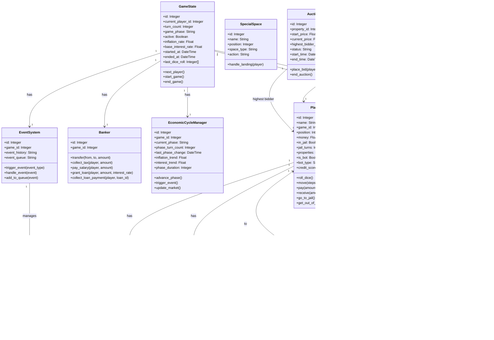

```mermaid
classDiagram
    %% Core Game Models
    class GameState {
        +id: Integer
        +current_player_id: Integer
        +turn_count: Integer
        +game_phase: String
        +active: Boolean
        +inflation_rate: Float
        +base_interest_rate: Float
        +started_at: DateTime
        +ended_at: DateTime
        +last_dice_roll: Integer[]
        +next_player()
        +start_game()
        +end_game()
    }
    
    class Player {
        +id: Integer
        +name: String
        +game_id: Integer
        +position: Integer
        +money: Float
        +in_jail: Boolean
        +jail_turns: Integer
        +properties: Property[]
        +is_bot: Boolean
        +bot_type: String
        +credit_score: Integer
        +roll_dice()
        +move(steps)
        +pay(amount)
        +receive(amount)
        +go_to_jail()
        +get_out_of_jail()
    }
    
    class Property {
        +id: Integer
        +name: String
        +position: Integer
        +group: String
        +price: Float
        +rent: Float
        +current_price: Float
        +current_rent: Float
        +owner_id: Integer
        +mortgaged: Boolean
        +houses: Integer
        +hotels: Integer
        +calculate_rent()
        +buy(player)
        +mortgage()
        +unmortgage()
        +add_house()
        +add_hotel()
    }
    
    class SpecialSpace {
        +id: Integer
        +name: String
        +position: Integer
        +space_type: String
        +action: String
        +handle_landing(player)
    }
    
    %% Financial Models
    class Banker {
        +id: Integer
        +game_id: Integer
        +transfer(from, to, amount)
        +collect_tax(player, amount)
        +pay_salary(player, amount)
        +grant_loan(player, amount, interest_rate)
        +collect_loan_payment(player, loan_id)
    }
    
    class Loan {
        +id: Integer
        +player_id: Integer
        +principal: Float
        +interest_rate: Float
        +term_turns: Integer
        +remaining_turns: Integer
        +status: String
        +payment_history: String
        +calculate_payment()
        +make_payment()
    }
    
    class CertificateOfDeposit {
        +id: Integer
        +player_id: Integer
        +principal: Float
        +interest_rate: Float
        +term_turns: Integer
        +remaining_turns: Integer
        +status: String
        +mature()
        +cash_out()
    }
    
    class Transaction {
        +id: Integer
        +from_id: Integer
        +to_id: Integer
        +amount: Float
        +type: String
        +timestamp: DateTime
        +description: String
    }
    
    %% Trading Model
    class Trade {
        +id: Integer
        +initiator_id: Integer
        +recipient_id: Integer
        +initiator_money: Float
        +recipient_money: Float
        +initiator_properties: Property[]
        +recipient_properties: Property[]
        +status: String
        +propose()
        +accept()
        +reject()
        +counter()
    }
    
    %% Auction Model
    class Auction {
        +id: Integer
        +property_id: Integer
        +start_price: Float
        +current_price: Float
        +highest_bidder_id: Integer
        +status: String
        +start_time: DateTime
        +end_time: DateTime
        +place_bid(player, amount)
        +end_auction()
    }
    
    %% Crime Model
    class Crime {
        +id: Integer
        +name: String
        +description: String
        +risk_level: Integer
        +payout_min: Float
        +payout_max: Float
        +jail_time: Integer
        +fine: Float
        +success_rate: Float
        +attempt(player)
    }
    
    %% Economic Cycle Model
    class EconomicCycleManager {
        +id: Integer
        +game_id: Integer
        +current_phase: String
        +phase_turn_count: Integer
        +last_phase_change: DateTime
        +inflation_trend: Float
        +interest_trend: Float
        +phase_duration: Integer
        +advance_phase()
        +trigger_event()
        +update_market()
    }
    
    %% Event Models
    class Event {
        +id: Integer
        +name: String
        +description: String
        +event_type: String
        +effect: String
        +trigger()
    }
    
    class EventSystem {
        +id: Integer
        +game_id: Integer
        +event_history: String
        +event_queue: String
        +trigger_event(event_type)
        +handle_event(event)
        +add_to_queue(event)
    }
    
    %% Community Fund
    class CommunityFund {
        +id: Integer
        +game_id: Integer
        +balance: Float
        +deposit(amount)
        +withdraw(amount)
        +payout_to_players()
    }
    
    %% Relationships
    GameState "1" --> "many" Player: has
    GameState "1" --> "1" Banker: has
    GameState "1" --> "1" EventSystem: has
    GameState "1" --> "1" EconomicCycleManager: has
    GameState "1" --> "1" CommunityFund: has
    
    Player "1" --> "many" Property: owns
    Player "1" --> "many" Loan: has
    Player "1" --> "many" CertificateOfDeposit: has
    Player "1" --> "many" Transaction: involved in
    
    Property "many" --> "1" Player: owned by
    
    Transaction "many" --> "1" Player: from
    Transaction "many" --> "1" Player: to
    
    Trade "many" --> "1" Player: initiator
    Trade "many" --> "1" Player: recipient
    Trade "many" --> "many" Property: involves
    
    Auction "1" --> "1" Property: for
    Auction "1" --> "1" Player: highest bidder
    
    EventSystem "1" --> "many" Event: manages
``` 