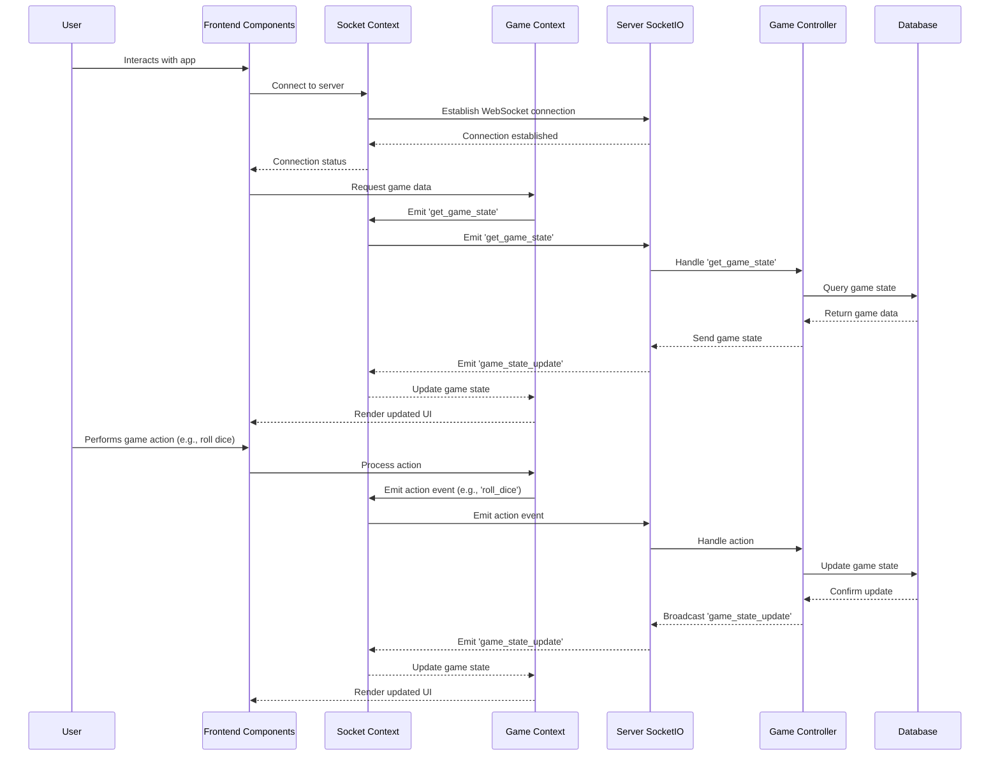

```mermaid
sequenceDiagram
    participant User
    participant FrontendComponents as Frontend Components
    participant SocketContext as Socket Context
    participant GameContext as Game Context
    participant ServerSocketIO as Server SocketIO
    participant GameController as Game Controller
    participant Database

    %% Initial connection
    User->>FrontendComponents: Interacts with app
    FrontendComponents->>SocketContext: Connect to server
    SocketContext->>ServerSocketIO: Establish WebSocket connection
    ServerSocketIO-->>SocketContext: Connection established
    SocketContext-->>FrontendComponents: Connection status

    %% Game data loading
    FrontendComponents->>GameContext: Request game data
    GameContext->>SocketContext: Emit 'get_game_state'
    SocketContext->>ServerSocketIO: Emit 'get_game_state'
    ServerSocketIO->>GameController: Handle 'get_game_state'
    GameController->>Database: Query game state
    Database-->>GameController: Return game data
    GameController-->>ServerSocketIO: Send game state
    ServerSocketIO-->>SocketContext: Emit 'game_state_update'
    SocketContext-->>GameContext: Update game state
    GameContext-->>FrontendComponents: Render updated UI

    %% Player action flow
    User->>FrontendComponents: Performs game action (e.g., roll dice)
    FrontendComponents->>GameContext: Process action
    GameContext->>SocketContext: Emit action event (e.g., 'roll_dice')
    SocketContext->>ServerSocketIO: Emit action event
    ServerSocketIO->>GameController: Handle action
    GameController->>Database: Update game state
    Database-->>GameController: Confirm update
    
    %% Broadcast updates to all clients
    GameController-->>ServerSocketIO: Broadcast 'game_state_update'
    ServerSocketIO-->>SocketContext: Emit 'game_state_update'
    SocketContext-->>GameContext: Update game state
    GameContext-->>FrontendComponents: Render updated UI
``` 