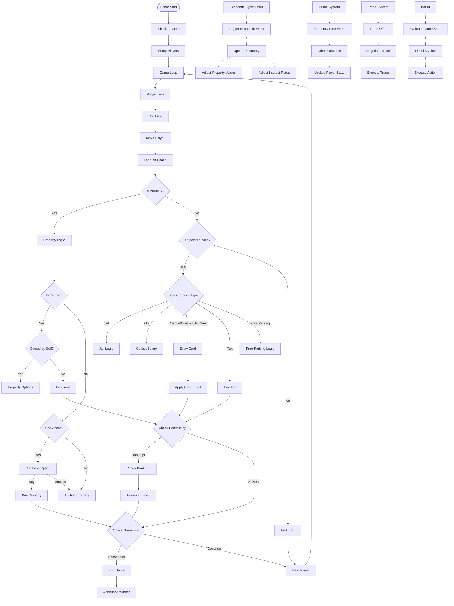

```mermaid
flowchart TD
    %% Main Game Flow
    Start([Game Start]) --> InitGame[Initialize Game]
    InitGame --> SetupPlayers[Setup Players]
    SetupPlayers --> GameLoop[Game Loop]
    
    %% Game Loop
    GameLoop --> PlayerTurn[Player Turn]
    PlayerTurn --> RollDice[Roll Dice]
    RollDice --> MovePlayer[Move Player]
    MovePlayer --> LandOnSpace[Land on Space]
    
    %% Space Types Decision
    LandOnSpace --> IsProperty{Is Property?}
    IsProperty -->|Yes| PropertyLogic[Property Logic]
    IsProperty -->|No| IsSpecialSpace{Is Special Space?}
    
    %% Property Logic
    PropertyLogic --> IsOwned{Is Owned?}
    IsOwned -->|Yes| IsSelf{Owned by Self?}
    IsOwned -->|No| CanAfford{Can Afford?}
    
    IsSelf -->|Yes| PropertyOptions[Property Options]
    IsSelf -->|No| PayRent[Pay Rent]
    
    CanAfford -->|Yes| PurchaseOption[Purchase Option]
    CanAfford -->|No| AuctionProperty[Auction Property]
    
    PurchaseOption -->|Buy| BuyProperty[Buy Property]
    PurchaseOption -->|Auction| AuctionProperty
    
    %% Special Space Logic
    IsSpecialSpace -->|Yes| SpecialSpaceType{Special Space Type}
    IsSpecialSpace -->|No| EndTurn[End Turn]
    
    SpecialSpaceType -->|Jail| JailLogic[Jail Logic]
    SpecialSpaceType -->|Go| CollectSalary[Collect Salary]
    SpecialSpaceType -->|Chance/Community Chest| DrawCard[Draw Card]
    SpecialSpaceType -->|Tax| PayTax[Pay Tax]
    SpecialSpaceType -->|Free Parking| FreeParkingLogic[Free Parking Logic]
    
    %% Card Logic
    DrawCard --> ApplyCardEffect[Apply Card Effect]
    
    %% End of Turn Logic
    PayRent --> CheckBankruptcy{Check Bankruptcy}
    BuyProperty --> CheckGameEnd{Check Game End}
    ApplyCardEffect --> CheckBankruptcy
    PayTax --> CheckBankruptcy
    
    CheckBankruptcy -->|Bankrupt| PlayerBankrupt[Player Bankrupt]
    CheckBankruptcy -->|Solvent| CheckGameEnd
    
    PlayerBankrupt --> RemovePlayer[Remove Player]
    RemovePlayer --> CheckGameEnd
    
    CheckGameEnd -->|Game Over| EndGame[End Game]
    CheckGameEnd -->|Continue| NextPlayer[Next Player]
    
    NextPlayer --> GameLoop
    
    %% End States
    EndGame --> AnnounceWinner[Announce Winner]
    EndTurn --> NextPlayer
    
    %% Economic Cycle
    EconomicCycle[Economic Cycle Timer] -.-> TriggerEconomicEvent[Trigger Economic Event]
    TriggerEconomicEvent -.-> UpdateEconomy[Update Economy]
    UpdateEconomy -.-> AdjustPropertyValues[Adjust Property Values]
    UpdateEconomy -.-> AdjustInterestRates[Adjust Interest Rates]
    
    %% Crime System
    CrimeSystem[Crime System] -.-> RandomCrimeEvent[Random Crime Event]
    RandomCrimeEvent -.-> CrimeOutcome[Crime Outcome]
    CrimeOutcome -.-> UpdatePlayerStats[Update Player Stats]
    
    %% Trade System
    TradeSystem[Trade System] -.-> TradeOffer[Trade Offer]
    TradeOffer -.-> NegotiateTrade[Negotiate Trade]
    NegotiateTrade -.-> ExecuteTrade[Execute Trade]
    
    %% Bot AI
    BotAI[Bot AI] -.-> EvaluateGameState[Evaluate Game State]
    EvaluateGameState -.-> DecideAction[Decide Action]
    DecideAction -.-> ExecuteAction[Execute Action]
``` 