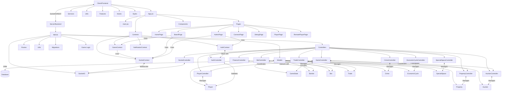

```mermaid
graph TB
    %% Main Architecture Components
    client[Client/Frontend]
    server[Server/Backend]
    database[(Database)]

    %% Client Subcomponents
    clientApp[App.jsx]
    clientMain[main.jsx]
    clientPages[Pages]
    clientComponents[Components]
    clientContexts[Contexts]
    clientServices[Services]
    clientUtils[Utils]
    clientFeatures[Features]
    clientHooks[Hooks]
    clientStyles[Styles]

    %% Server Subcomponents
    serverApp[app.py]
    serverControllers[Controllers]
    serverModels[Models]
    serverRoutes[Routes]
    serverUtils[Utils]
    serverMigrations[Migrations]
    serverGameLogic[Game Logic]
    serverSocketIO[SocketIO]

    %% Context Components
    socketContext[SocketContext]
    gameContext[GameContext]
    authContext[AuthContext]
    notificationContext[NotificationContext]

    %% Pages
    homePage[HomePage]
    boardPage[BoardPage]
    adminPage[AdminPage]
    connectPage[ConnectPage]
    debugPage[DebugPage]
    playerPage[PlayerPage]
    remotePage[RemotePlayerPage]

    %% Main Controllers
    gameController[GameController]
    playerController[PlayerController]
    propertyController[PropertyController]
    auctionController[AuctionController]
    botController[BotController]
    socketController[SocketController]
    tradeController[TradeController]
    financeController[FinanceController]
    authController[AuthController]
    economicController[EconomicCycleController]
    crimeController[CrimeController]
    specialSpaceController[SpecialSpaceController]

    %% Main Models
    playerModel[Player]
    propertyModel[Property]
    gameStateModel[GameState]
    bankerModel[Banker]
    auctionModel[Auction]
    botModel[Bot]
    tradeModel[Trade]
    crimeModel[Crime]
    economicCycleModel[EconomicCycle]
    specialSpaceModel[SpecialSpace]

    %% Client Relationships
    client --> clientApp
    clientApp --> clientMain
    clientApp --> clientPages
    clientApp --> clientComponents
    clientApp --> clientContexts
    client --> clientServices
    client --> clientUtils
    client --> clientHooks
    client --> clientFeatures
    client --> clientStyles

    %% Context Relationships
    clientContexts --> socketContext
    clientContexts --> gameContext
    clientContexts --> authContext
    clientContexts --> notificationContext

    %% Page Relationships
    clientPages --> homePage
    clientPages --> boardPage
    clientPages --> adminPage
    clientPages --> connectPage
    clientPages --> debugPage
    clientPages --> playerPage
    clientPages --> remotePage

    %% Client-Server Relationship
    client <-->|SocketIO/REST| server

    %% Server Relationships
    server --> serverApp
    serverApp --> serverControllers
    serverApp --> serverModels
    serverApp --> serverRoutes
    serverApp --> serverUtils
    serverApp --> serverMigrations
    serverApp --> serverGameLogic
    serverApp --> serverSocketIO

    %% Controller Relationships
    serverControllers --> gameController
    serverControllers --> playerController
    serverControllers --> propertyController
    serverControllers --> auctionController
    serverControllers --> botController
    serverControllers --> socketController
    serverControllers --> tradeController
    serverControllers --> financeController
    serverControllers --> authController
    serverControllers --> economicController
    serverControllers --> crimeController
    serverControllers --> specialSpaceController

    %% Model Relationships
    serverModels --> playerModel
    serverModels --> propertyModel
    serverModels --> gameStateModel
    serverModels --> bankerModel
    serverModels --> auctionModel
    serverModels --> botModel
    serverModels --> tradeModel
    serverModels --> crimeModel
    serverModels --> economicCycleModel
    serverModels --> specialSpaceModel

    %% Database Relationships
    serverModels <-->|ORM| database

    %% Socket Connections
    socketContext <-->|WebSocket| serverSocketIO
    socketController <--> serverSocketIO

    %% Key Game Flow Connections
    gameContext -->|Uses| socketContext
    boardPage -->|Uses| gameContext
    boardPage -->|Uses| socketContext
    gameController <-->|Manages| gameStateModel
    gameController <-->|Coordinates| playerController
    gameController <-->|Coordinates| propertyController
    gameController <-->|Coordinates| auctionController
    playerController <-->|Manages| playerModel
    propertyController <-->|Manages| propertyModel
    auctionController <-->|Manages| auctionModel
    botController <-->|Manages| botModel
    tradeController <-->|Manages| tradeModel
    economicController <-->|Manages| economicCycleModel
    financeController <-->|Interacts with| bankerModel
    crimeController <-->|Manages| crimeModel
    specialSpaceController <-->|Manages| specialSpaceModel

    %% Authentication Flow
    authContext <-->|REST API| authController
    authController <-->|Validates| playerModel

    %% Admin Interface
    adminPage -->|Uses| socketContext
    adminPage -->|Uses| authContext
``` 